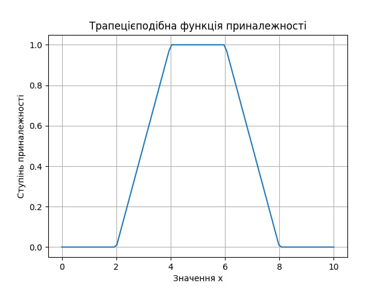

# Лабораторна робота №1

- [Лабораторна робота №1](#лабораторна-робота-1)
  - [Тема](#тема)
  - [Мета](#мета)
  - [Індивідуальне завдання](#індивідуальне-завдання)
  - [Виконання](#виконання)
    - [Трикутна та трапецієподібна функції](#трикутна-та-трапецієподібна-функції)
    - [Фукнції Гаусса](#фукнції-гаусса)
    - [Дзвін](#дзвін)
    - [Сигмоїдальні](#сигмоїдальні)
    - [Поліноміальні](#поліноміальні)
    - [Логічні оператори](#логічні-оператори)
    - [Множинні](#множинні)
    - [Доповнення](#доповнення)
  - [Висновок](#висновок)

## Тема

Дослідження способів формування нечітких множин і операцій над ними

## Мета

Побудувати нечіткі множин з використанням різних типів функцій приналежності. Виконати найбільш поширені логічні операції над нечіткими множинами.

## Індивідуальне завдання

За допомогою пакетів моделювання або мови програмування високого рівня:

1. Побудувати трикутну і трапецієподібну функцію приналежності.
2. Побудувати просту і двосторонню функцію приналежності Гаусса, утворену за допомогою різних функцій розподілу.
3. Побудувати функцію приналежності "узагальнений дзвін", яка дозволяє представляти нечіткі суб'єктивні переваги.
4. Побудувати набір сігмоїдних функцій: основну односторонню, яка відкрита зліва чи справа; додаткову двосторонню; додаткову несиметричну.
5. Побудувати набір поліноміальних функцій приналежності (Z-, PI- і S-функцій).
6. Побудувати мінімаксну інтерпретацію логічних операторів з використанням операцій пошуку мінімуму і максимуму.
7. Побудувати вірогідну інтерпретацію кон'юнктивну і диз'юнктивних операторів.
8. Побудувати доповнення нечіткої множини, яке описує деяке розмите судження і представляє собою математичний опис вербального вираження, який заперечує це нечітка множина.
При виконанні пунктів 1 - 8 індивідуального завдання, значення змінних a, b, c, d і т.д. необхідно вибирати довільним чином.
9. Оформіть звіт по лабораторній роботі.

## Виконання

### Трикутна та трапецієподібна функції

### Фукнції Гаусса

### Дзвін

### Сигмоїдальні

### Поліноміальні

### Логічні оператори

### Множинні

### Доповнення

## Висновок

На цій лабораторній роботі я детальніше познайомився з операціями над нечіткими множинами та побудував графіки відомих функцій належності. Тепер мені зрозуміліше працювати з нечіткими множинами та я тепер можу математично представляти популярні функції.
