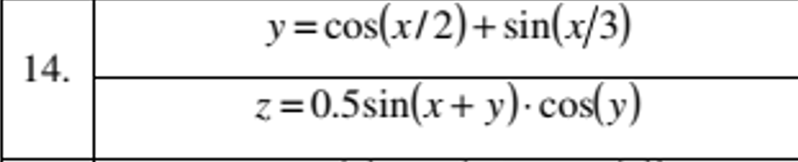
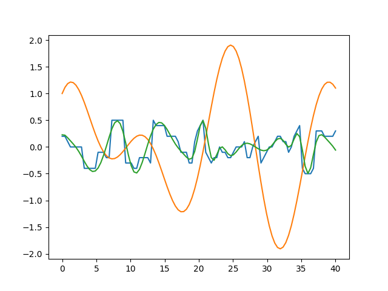
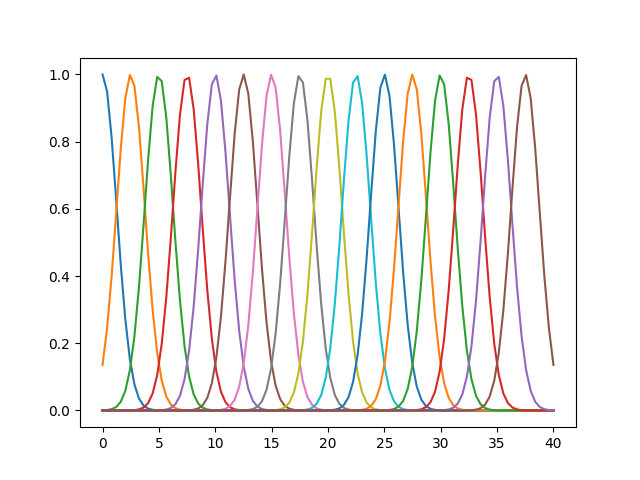
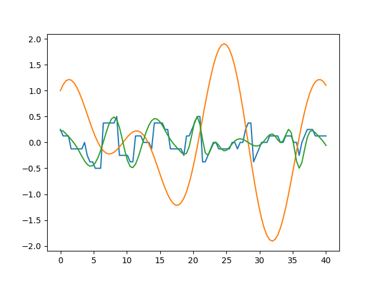
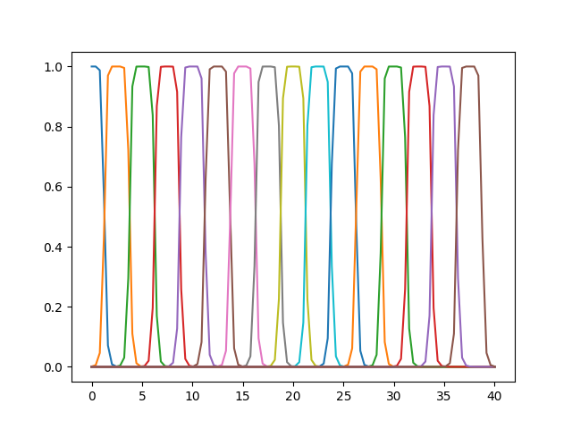

# Лабораторна робота №1

## Тема

Моделювання функцій з двох змінних засобами нечіткої математики

## Мета

Промоделювати засобами нечіткої логіки функцію з двох змінних. Провести дослідження форми функції принадлежності на якість моделювання

## Виконання

### Варіант

### Пояснення програми

Оскільки в мене доволі багато кривих, розбиття на терми логічних змінних зроблю автоматично. За допомогою різних функцій належності, я зробив лямбди для кожного з термів. Надалі за допомогою цих лямбд я зможу створити правила за якими буде працювати моя нечітка логіка.

Розгляньмо детальніше як це відбувається. Код програми знаходиться за [[цим посиланням]](fuzzy-func/fuz.py). На початку створюються параметри функцій, такі як мінімальні та максимальні значення та скільки точок на графіках будувати і скільки термів потрібно на кожну змінну.

Далі йде допоміжна функція для знаходження середини певного i-того терма, та функція для створення різних функцій для кожного терма. Далі йде функція для фазифікації та дефазифікації. З цими функціями можна будувати збірку правил, за якими буде працювати схема. Оскільки в нас задано скільки в нас термів, ми ітеруємося за кожним та по x та по y, дефазифікуємо їх та обраховуєм значення z в цих точках, які ми фазифікуємо та додаємо до правил.

З цими правилами нам залишається тільки фазифікувати вхідні змінні та знайти відповідне правило, яке ми виконуєм та дефазифікуємо вивід.

### Порівняння функцій

Порівняння будуть виконуватись на 100 точках та 16 термів до кожної змінної. Оцінка буде відбуватись візуально та за допомогою відомих метрик.

#### Гаусса

При використанні функції Гаусса, вийшов наступний графік:

Доволі гарно виглядає, алгоритми показують наступні значення похибок:

Mean Squared Error (MSE): 0.036002010430803116
Mean Absolute Error (MAE): 0.13359358549634642
R-squared (R2) Score: 0.3942462625798633

#### Дзвін

При використанні функції дзвону, вийшли наступні графіки:

Gaussian

Mean Absolute Error (MAE): 0.05565270322005556
Root Mean Squared Error (RMSE): 0.07479780954070214
R-squared (Coefficient of Determination): 0.9063433268904729

Bell

Mean Absolute Error (MAE): 0.05565270322005556
Root Mean Squared Error (RMSE): 0.07479780954070214
R-squared (Coefficient of Determination): 0.9063433268904729
