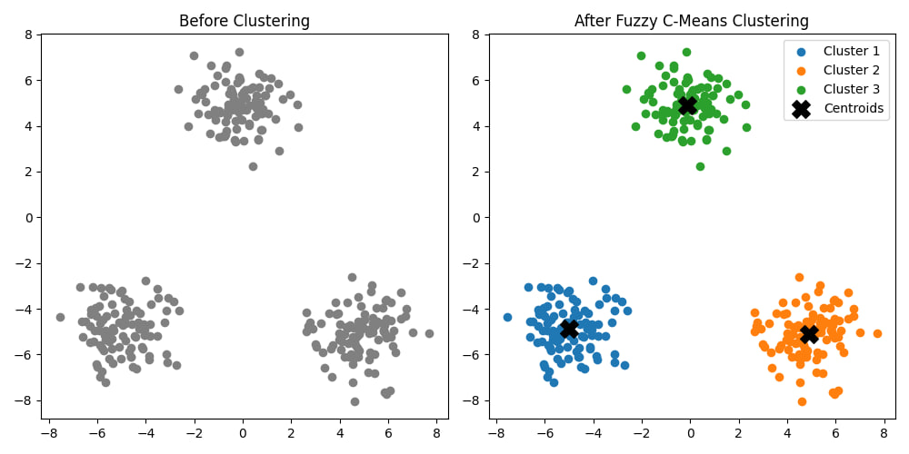

# Лабораторна робота №3

## Тема

Дослідження алгоритму нечіткої кластеризації

## Виконання

### Створення даних

Для створення даних використаємо нормальний розподіл. Функція normal з бібліотеки numpy дозволяє швидко та просто створири дані, які будуть розкидані біля трьох точок. Далі робимо графік з всіма точками в сірому кольорі, оскільки ми ще не знаємо що якого класу вони належать.

### Класифікація

Методи нечіткої кластеризації реалізовані в відповідній бібліотеці, тому можемо просто застосувати fuzz.cluster.cmeans, задавши прості параметри та кількість кластерів для знаходження цих кластерів. Далі для кожного класу запитаємо всі точки які до нього належать та додамо їх на інший графік.

### Графік

## Висновок

На цій лабораторній роботі я познайомився з методами кластерізації за допомогою нечіткої логіки.
