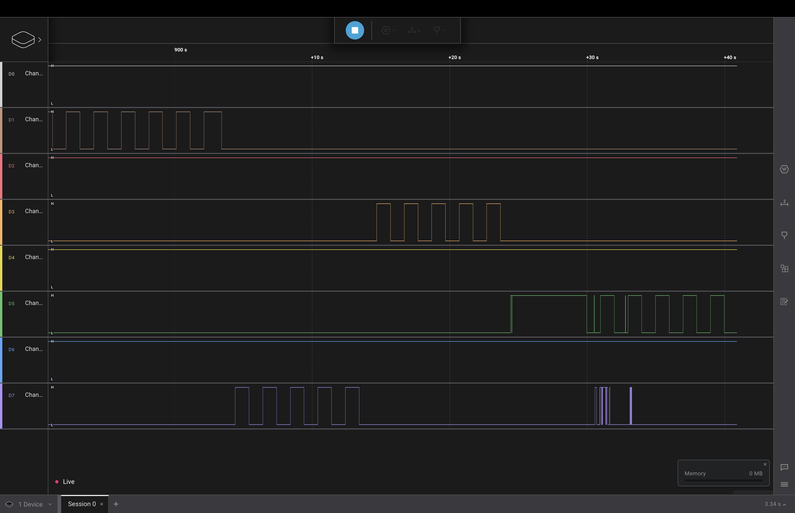

# Лабораторна робота №2

## Тема

LEDs, Buttons, Interrupts

## Виконання

### Код

Завдання виконане в поточній директорії. Код всього проекту окрім залежностей доступент... тут

### Відео виконання

Відео можна переглянути у youtube shorts <https://youtu.be/axqDolaGjDs>

### Логічний аналізатор

На наведеному малюнку видно як блимають різні канали, під'єнані до підповідних пінів. Місце де є щось незрозуміли, в мене відійшли контакти трохи та я їх назад нідів.

## Висновок

На цій лабораторній роботі я вивчив як працювати з перериваннями під час натискання на кнопку, для оптимізації роботи процессора(не треба постійно перевіряти стан кнопки)
