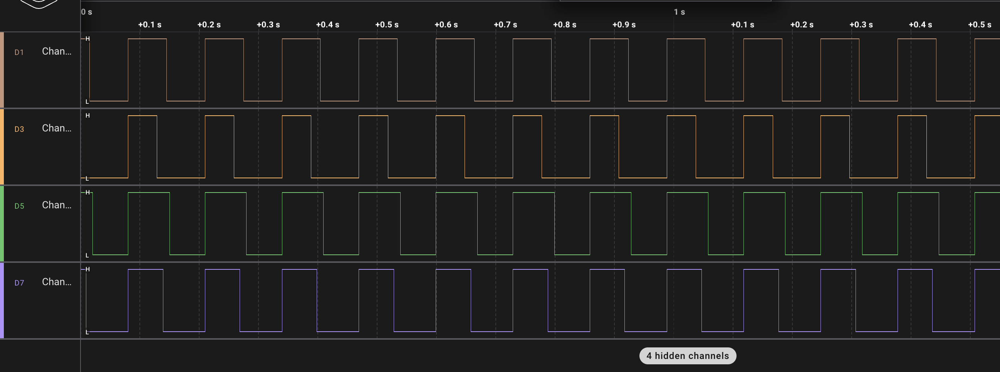
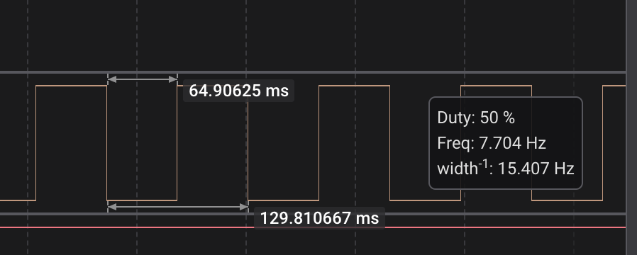
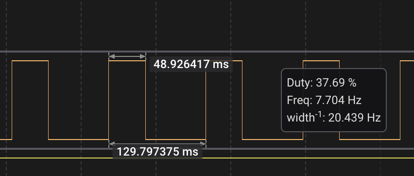
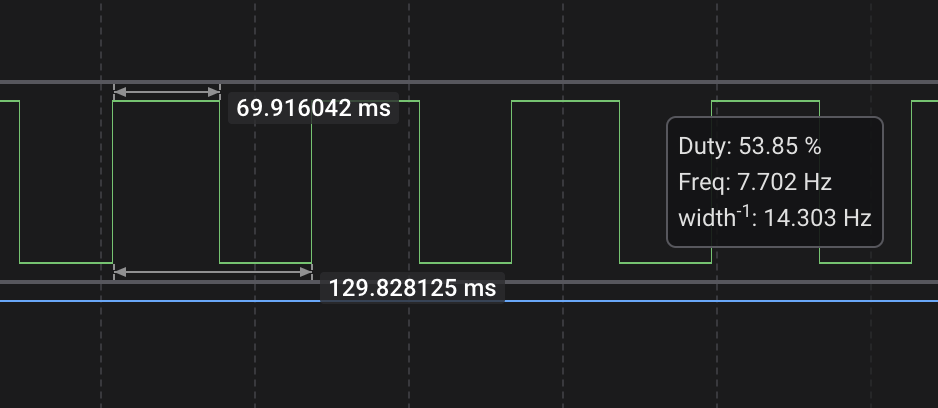
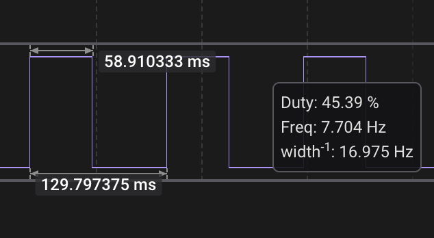

# Лабораторна робота №3

## Тема

Таймери

## Варіант

| # | Frequency, kHz | LED RED | LED GREEN | LED ORANGE | LED BLUE |
|---|----------------|---------|-----------|------------|----------|
| 17| 7.75           | 54      | 38        | 46         | 50       |

## Виконання

### Обрахунки

Для частоти 7.75 кГц, період сигналу в мілісекундах (мс) становить приблизно 129.03 мс. Ось час, протягом якого кожен світлодіод залишається увімкненим протягом одного періоду, з урахуванням відсотка робочого циклу:

- LED червоний: приблизно 69.68 мс (54% робочого циклу)
- LED зелений: приблизно 49.03 мс (38% робочого циклу)
- LED помаранчевий: приблизно 59.35 мс (46% робочого циклу)
- LED синій: приблизно 64.52 мс (50% робочого циклу)

### Логічний аналізатор

#### Всі

#### Синій

#### Зелений

#### Червоний

#### Помаранчевий

## Висновок

На цій лабораторній роботі я познайомився з таймерами та навчився використовувати їх разом з перериваннями та окремо для Широтно-Імпульсної модуляції.
