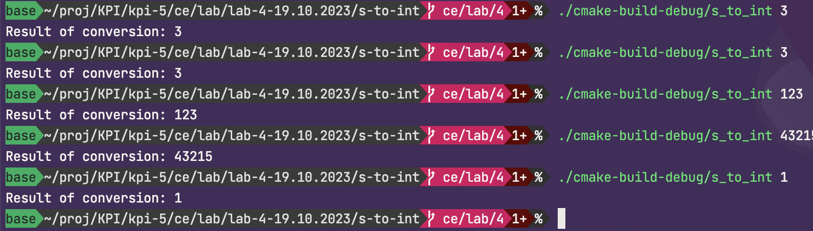

# Перетворення числа на рядок

Я тут використав невеликий алгоритм, де я почергово відокремлював цифри за домопомгою операцій ділення та остачі від ділення, та "додавав" їх значення до символу 0, щоб отримати символ тієї цифри та далі аккумулював їх у рядку

## Результат виконання

