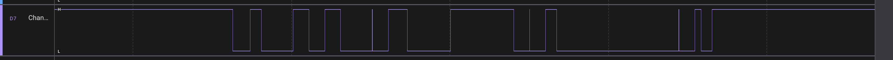

# Лабораторна робота №6

## Тема

Communication interfaces (I2C)

## Мета

зрозуміти як працюють I2C інтерфейс та як його налаштовувати

## Виконання

### Мелодія

Мелодія яку грає схема – дует фортепіано з мультфільму "Труп нареченої".

Оригінал можна переглянути тут: <https://www.youtube.com/watch?v=nuEOA9GbK6U>

Роботи схеми можна переглянути тут: <https://youtube.com/shorts/fE_FZqp9U1E>

### Логічний аналізатор

## Висновок

На цій лабораторній роботі я використав інтерфейс IIC для програвання запрограмованої мелодії за схемі.
