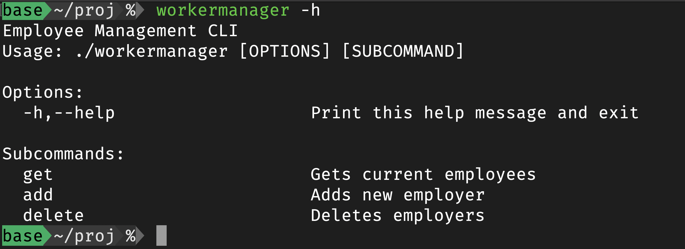
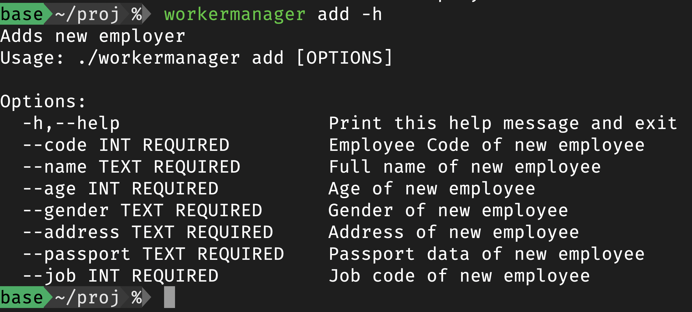
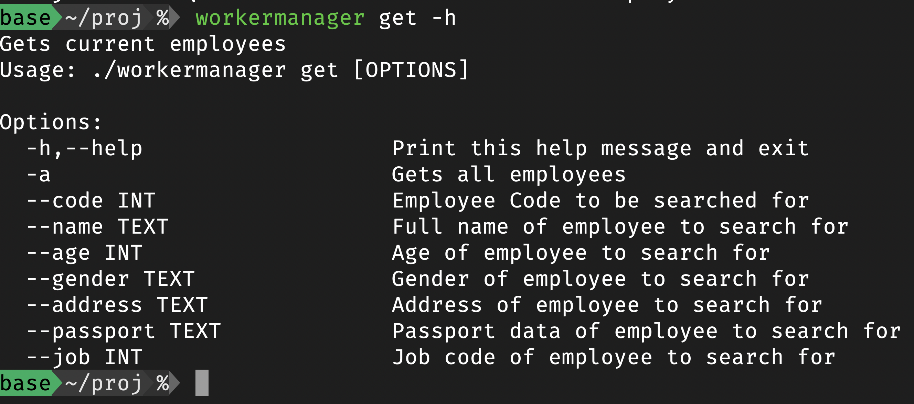
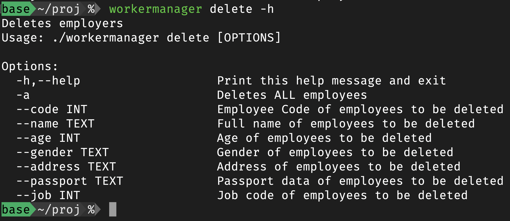
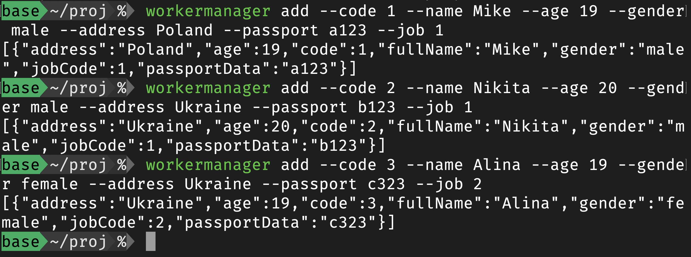
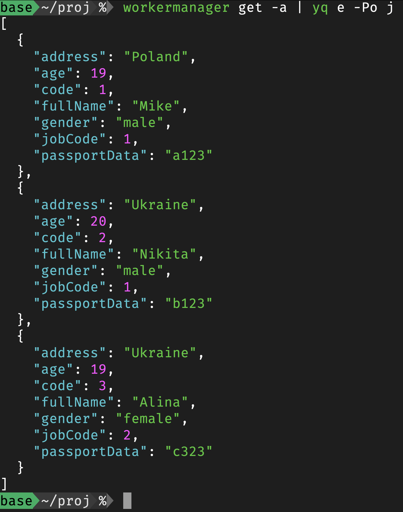
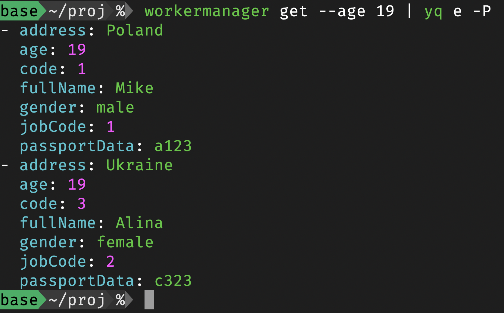
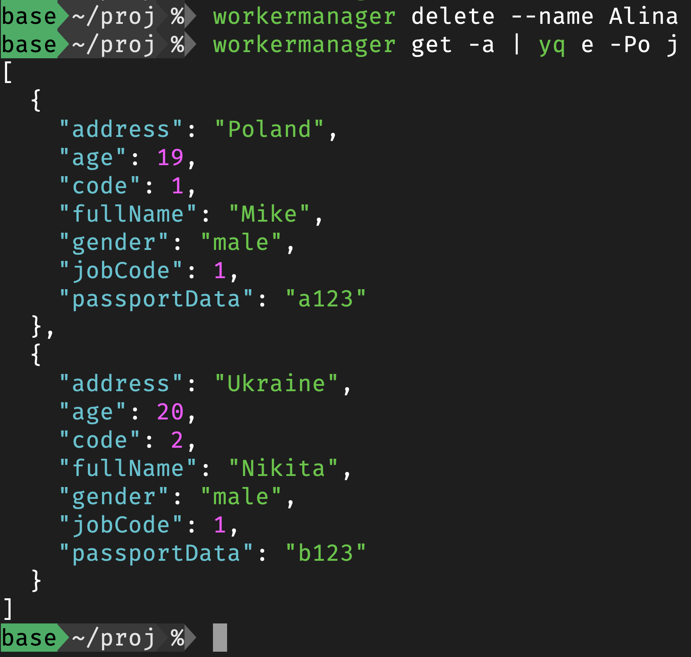

# Лабораторна робота 1

- [Лабораторна робота 1](#лабораторна-робота-1)
  - [Тема](#тема)
  - [Завдання](#завдання)
  - [Виконання](#виконання)
    - [Опис застосунку](#опис-застосунку)
    - [Використані бібліотеки](#використані-бібліотеки)
    - [Структура коду](#структура-коду)
    - [Використання застосунку](#використання-застосунку)
  - [Висновок](#висновок)

## Тема

Технології розробки системних програм для POSIX сумісних (сертифікованих) операційних систем

## Завдання

1. Відповідно до завдання і тематичної спрямованості, що надано у додатку 1, користуючись вихідним кодом додатку 2, створити класи, що реалізують тематичну спрямованість додатку 1.
2. Під час розробки навчальної програми для кожного класу створити заголовочний файл і файл реалізації.
3. Створити файл main.cpp для екземплярів класу на купі пам'яті і на стеку. Провести тестування класів на етапі виконання. Для цього скористатися утилітою Makefile, текстовим редактором або середовищем розробки. Запуск реалізувати у POSIX сумісній ОС.

## Виконання

Повний вихідний код цього завдання можна переглянути

Це завдання доволі просте та не дуже цікаве, тому щоб додати трохи складності, я зроблю завдання в об'єктно орієнтованому стилі відповідно до книги написаної чотирма геніями програмування [[Design Patterns. Elements of Reusable Object-Oriented Software]](https://www.javier8a.com/itc/bd1/articulo.pdf). Ця книга повпливала на всі мови програмування починаючи з C++, бо саме для нього вона писалась.

### Опис застосунку

Застосунок для роботи з певними працівниками. Створюється command line interface для взаємодії з певною інформацією щодо працівників. Потрібен функціонал для створення нових працівників, перегляд всіх поточних та деяких за допомогою фільтрів та видалення працівників. Для зручності відображення працівників буде у форматі  [[JSON]](https://www.json.org/json-en.html), бо цей формат можна буде потім перевикористати в інших cli застосунках, таких як [[yq]](https://github.com/mikefarah/yq).

### Використані бібліотеки

Оскільки потрібно користуватись вже написаними бібліотеками для досягнення оптимальних результатів в цій лабораторній використані наступні лабораторні:

- [[nlohmann/json]](https://github.com/nlohmann/json) для зберігання інформації та перетворення c++ типів у json об'єкти
- [[CLIUtils/CLI11]](https://github.com/CLIUtils/CLI11) для створення command line interface, та полегшення розуміння та використання програми
- [[google/fruit]](https://github.com/google/fruit) для реалізації 5-го принципу [[SOLID]](https://en.wikipedia.org/wiki/SOLID), за допомогою dependency injeciton

Ці бібліотеки були завантащені відповідно до інструкції на їх гітхаб репозиторіях. Ці бібліотеки потім були включені у [[CMakeLists.txt]](cpp/lab/lab-1-25.09.2023/workermanager/CMakeLists.txt) для допомоги компілятору при побудові цього проекту. За допомогою відповідних команд були включені та додані до лінкування файли бібліотек.

### Структура коду

Основа цього застосунку файл [[main.cpp]](cpp/lab/lab-1-25.09.2023/workermanager/main.cpp), в якому знаходиться конфігурація cli. Щоб відповідати першому принципу [[SOLID]](https://en.wikipedia.org/wiki/SOLID), а саме single-responsiility principle, код для роботи з json та для виконання команд був винесений в окремі класи.

Репрезентацію працівника можна знайти у директорії [[entities]](cpp/lab/lab-1-25.09.2023/workermanager/entities), в якій знаходиться відповідний клас.

Утиліта для працювання з json розташована у директорії [[tools]](cpp/lab/lab-1-25.09.2023/workermanager/tools), відповідно до п'ятого принципу, потрібно залежати від абстракцій а не контретики, тому був створений загальний інтерфейс для роботи з json, та за допомогою dependency injection конфігурації у вигляді

```(cpp)
fruit::Component <IJsonParser> getIJsonParserComponent() {
    return fruit::createComponent().bind<IJsonParser, JsonParser>();
}
```

Ми можемо використовувати тільки інтерфес, а на його місце буде підставлений конктерний клас, і нам не потрібно про нього знати та зв'язувати наш код.

Код виконання кожної команди та відповідні їй абстрації, знаходяться в директорії [[commands]](cpp/lab/lab-1-25.09.2023/workermanager/commands).

### Використання застосунку

Оскільки це cli застосунок, до нього написана документація, яку можна переглянути надавши флаг `-h`.
  
  
  
Як можна побачити, в нагого застосунка є 3 підкоманди, переглянемо кожну з них.
  

  

  

  
Як видно з Рисунків 2-4 до кожної команди пояснені її опції, що дозволяє новому користувачеві в ній розібратись.

Створимо кілька працівників



Застосунок після створення працівника надає його репрезентацію у json форматі. Переглянемо їх, застосувавши утиліту [[yq]](https://github.com/mikefarah/yq), з налаштуваннями для перегляду красивого json.



Переглянемо тепер тільки працівників, яким 19 років, та за допомогою [[yq]](https://github.com/mikefarah/yq) конфертуємо вихідний json у yaml



На рисунку видно, що фільтрація працівників працює нормально та оскільки ми виводимо json, який інші утиліти можуть розуміти, за допомогою pipeline оператору в POSIX системі, ми можемо надати вивід нашої програми як вхід наступної.

А тепер видалимо користувача за певним критерієм та переглянемо знову всіх користувачів.



Оскільки команда показати всіх, не вивіла Аліну, її було успішно видалено.

## Висновок

На цій лабораторній роботі я навчився додавати залежності до С++ проектів та налогоджувати їх у CMakeLists.txt файлі. Також я притримувався принципів об'єктно орієнтованого програмування та використав dependency injection у С++. Також навчився розробляти застосунки які просто інтегруються з іншими застосунками в POSIX сумісних системах.
