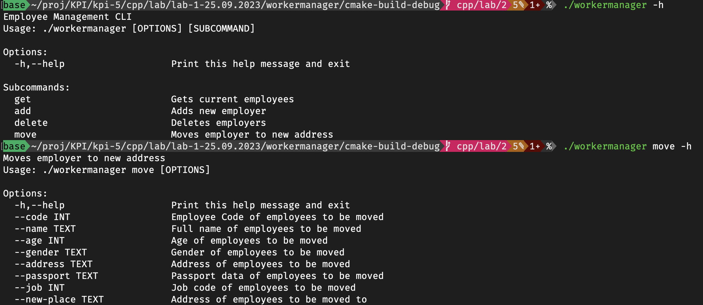
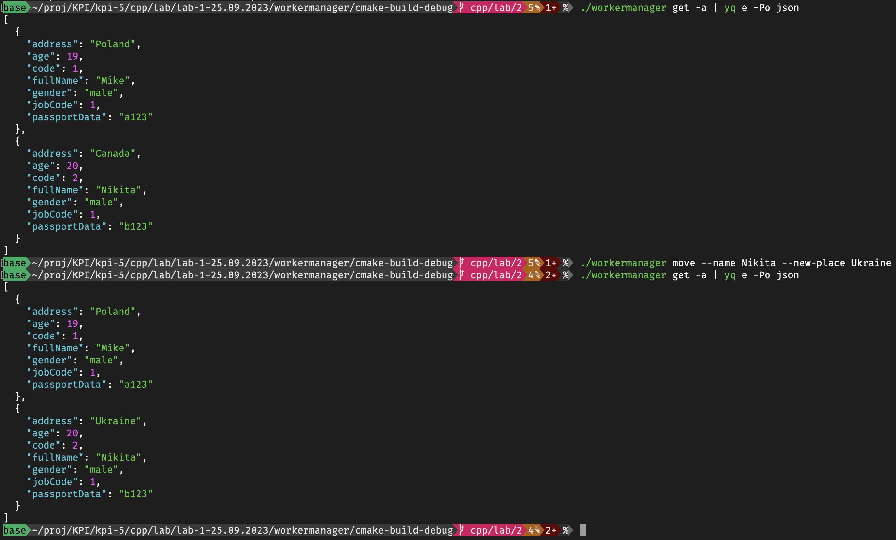
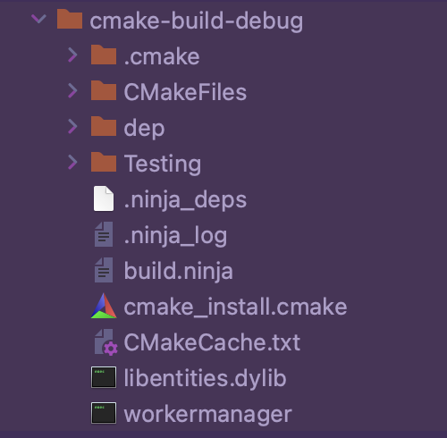

# Лабораторна робота №2

## Тема

Створення статичних і динамічних бібліотек для POSIX сумісних (сертифікованих) операційних систем

## Виконання

Репозиторій з кодом: <https://github.com/kiIIer/kpi-5/tree/main/cpp/lab/lab-1-25.09.2023/workermanager>

### Зміни в коді

Для спрощення виконання, я просто змінив проект для першої лабораторної, оскільки він вже був написаний з ООП. Для функціоналу зміни об'єктів я створив окрему підкоманду для переміщення робітників на нову адресу. Ось нова документація застосунку:

Та приклад використання цієї підкоманди:

### Динамічна бібліотека

Оскільки одна з вимог - використання динамічної бібліотеки, файл [[CMakeLists.txt]](https://github.com/kiIIer/kpi-5/blob/main/cpp/lab/lab-1-25.09.2023/workermanager/CMakeLists.txt) був зминений відповідно. Тепер в мене є динамічна бібліотека для працівників, оскільки команди специфічні для цього застосунку, я залишив їх статичними. Але можливо інші застосунки повинні працювати з нашими робітниками, тому це дикамічна бібліотека.

Як видно з рисунку, після компіляції з'явився застосунок та диманічна бібліотека в окремому файлі.

## Висновок

На цій лабораторній роботі я розширив функціонал попереднього застосунку та використав динамічні бібліотеки.