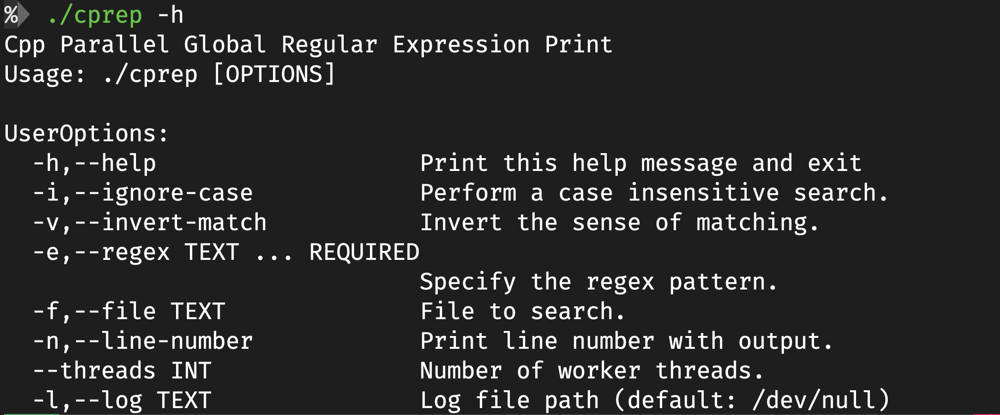
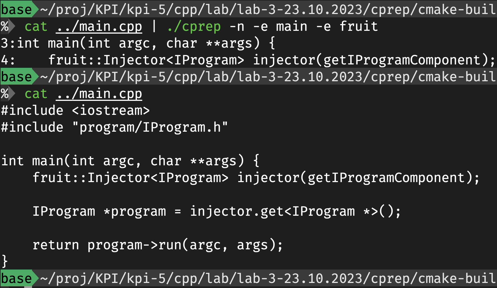
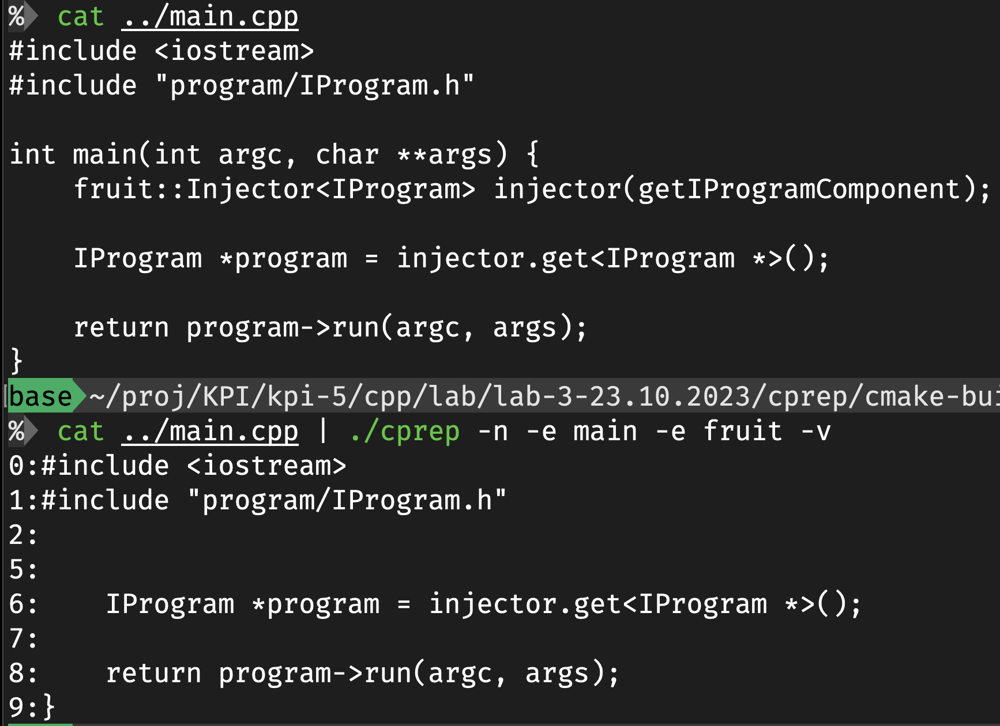
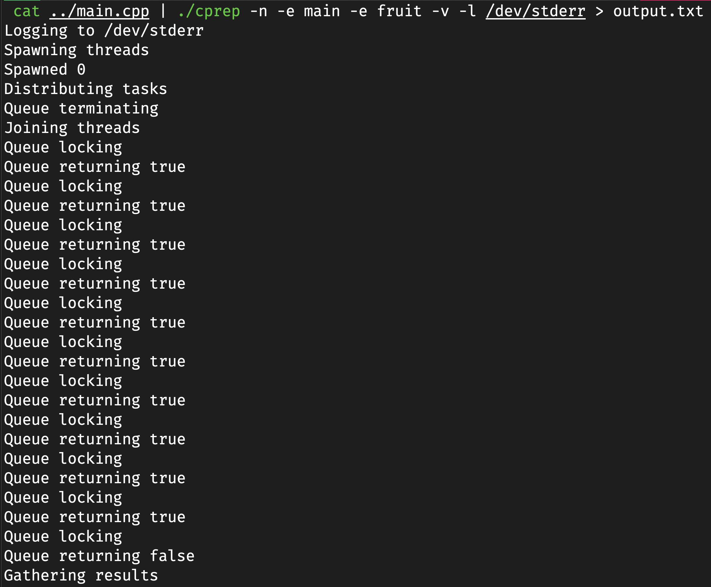
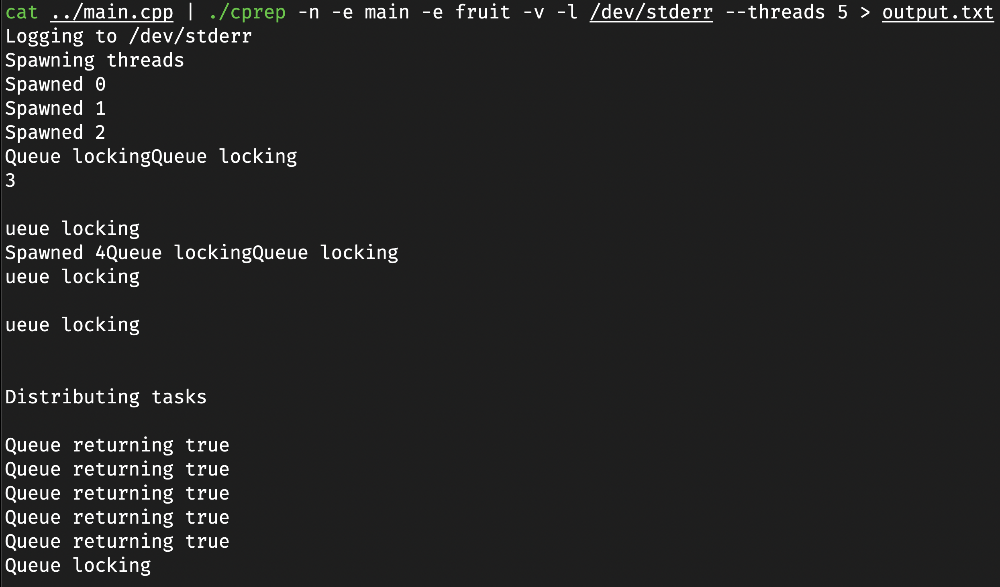

# Лабораторна робота №3

## Виконання

## Вступ

У даній лабораторній роботі було створено програму для паралельного пошуку рядків у текстовому файлі за допомогою регулярних виразів. Це дозволяє ефективно обробляти великі об'єми даних.

### Основні компоненти програми

1. **UserOptions**: Структура, що зберігає параметри, вказані користувачем. До таких параметрів належать, наприклад, шлях до файлу, регулярний вираз для пошуку, кількість робочих потоків тощо.

2. **Queue**: Клас, який реалізує потокобезпечну чергу, використовуючи `std::mutex` та `std::condition_variable` для синхронізації доступу до даних.

3. **Worker**: Компонент, який здійснює обробку вхідних даних у многопотоковому режимі.

4. **OptionParser**: Відповідає за аналіз та парсинг командного рядка, а також зберігання параметрів у структурі `UserOptions`.

### Як програма працює

1. Параметри командного рядка аналізуються за допомогою `OptionParser` і зберігаються в `UserOptions`.

2. На основі параметрів створюються робочі потоки (`Worker`).

3. Завдання для пошуку розподіляються між робочими потоками через потокобезпечну чергу `Queue`.

4. Кожен робочий потік обробляє своє завдання і, якщо знаходить відповідність регулярному виразу, додає результат до результативної черги.

5. Головний потік збирає результати з результативної черги.

### Приклади використання

#### Команда help

#### Базове фільтрування

#### Інверсія

#### Перегляд логів

#### Логи з багатьма потоками

## Висновок

На цій лабораторній роботі я познайомився з принципами паралельної обробки даних в c++ та створив свою версію старої команди grep. Реалізував частину консольного інтерфейсу grep але в багатьох потоках. Розібрався з роботою з потоками вводу-виводу в с++