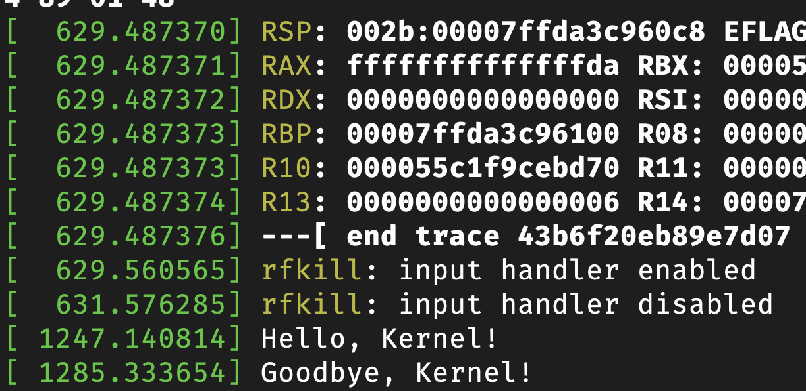
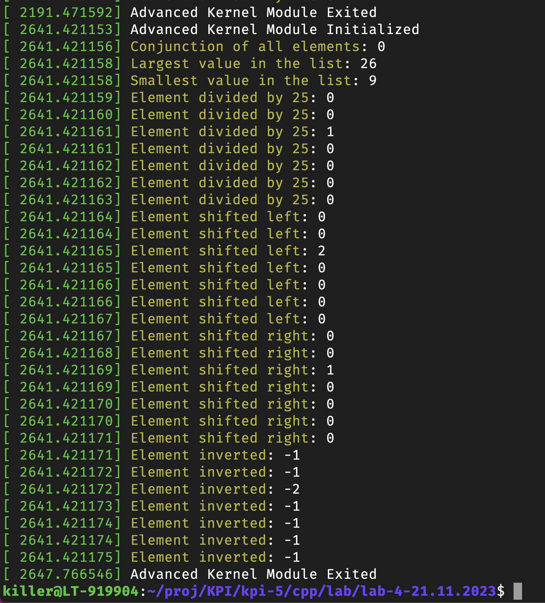

# Лабораторна робота №4

## Тема

Технології розробки модулів ядра для операційної системи Linux.

## Виконання

Код для кожного завдання наведено у відповідних папках. На них далі будуть надані додаткові посилання. Ці завдання були виконані та перевірені на моєму іншому комп'ютері з операційною системою Ubuntu.

### Завдання 1

Вивести hello kernel, виконано у файлі [[hello_colonel.c]](./hello_colonel/hello_colonel.c)

Результати виконання програми:

### Завдання 2

Виконати завдання. Для зручності в мене всі елементи крім одного менше 25, тобто після ділення, в нас будуть нулі та тільки одна 1. Завдання виконано у файлі [[advanced_tasks.c]](./advanced_tasks/advanced_tasks.c).

Результати виконання програми:

