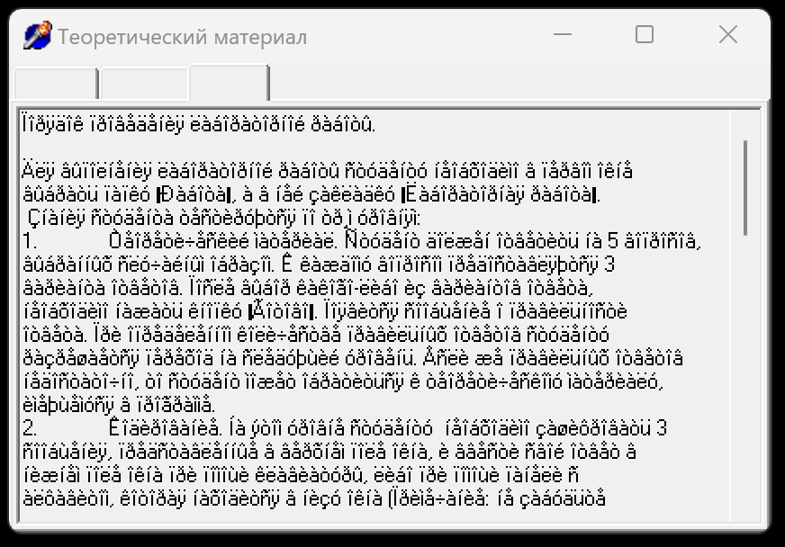
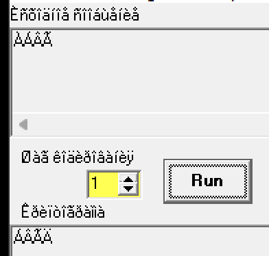
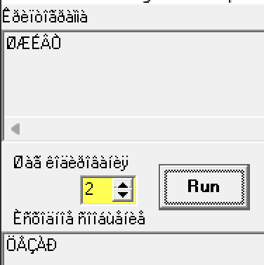
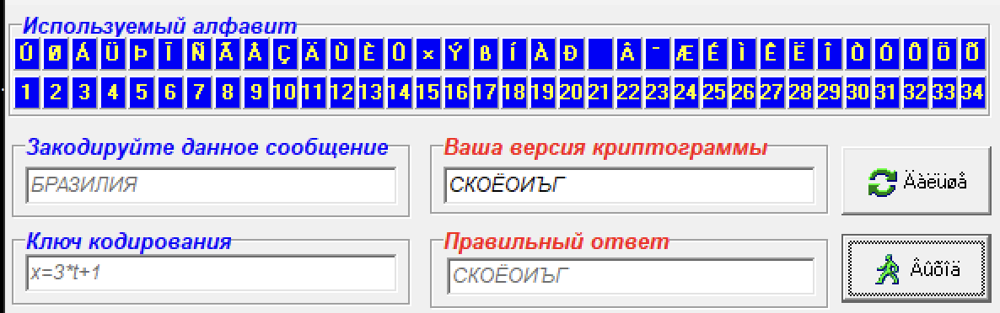
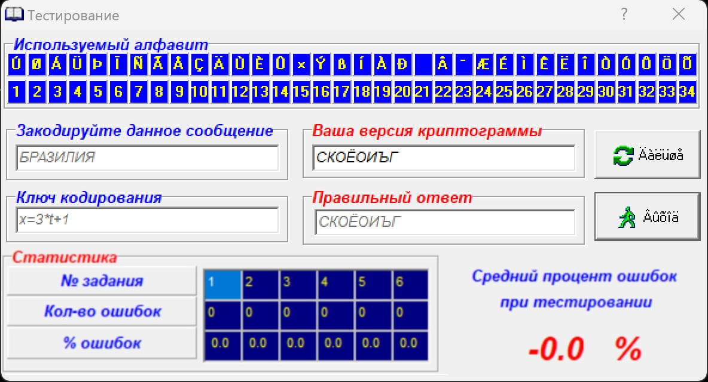
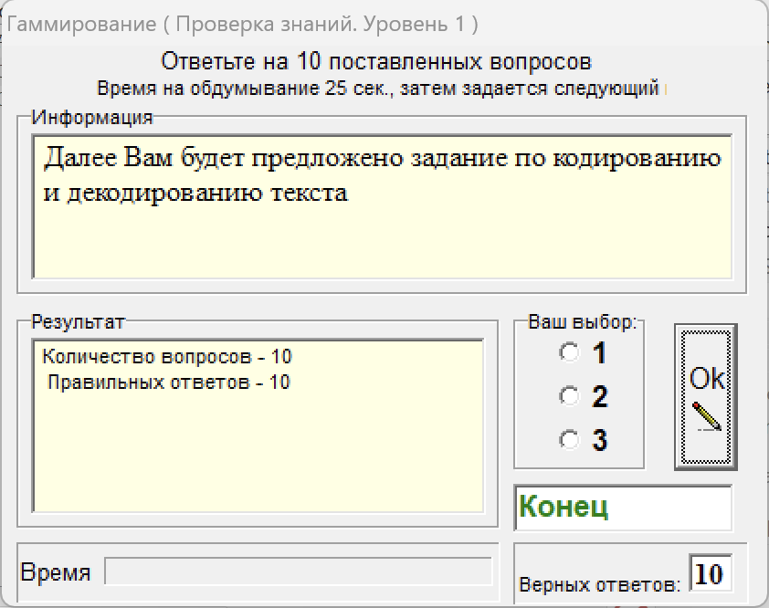
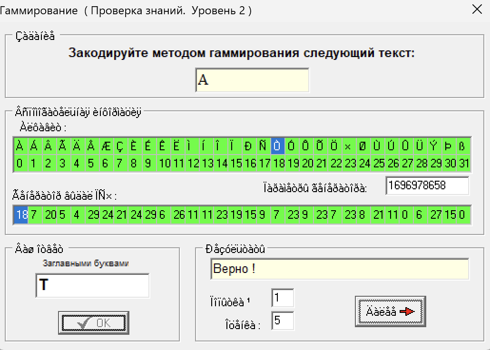
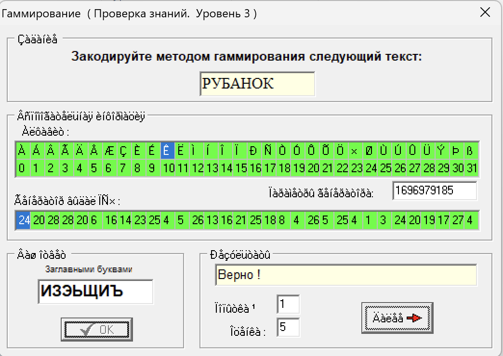
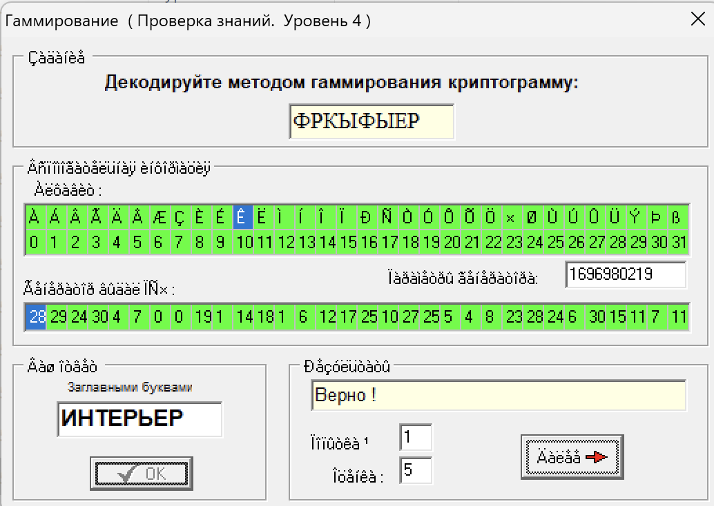
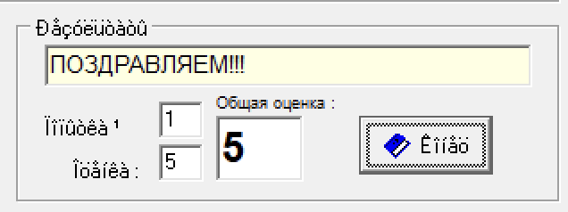

# Лабораторна робота №1

## Тема

Шифр Цезаря. Шифр Тритеміуса.Шифр Гамірування.

## Виконання

### Шифр Цезаря

Після прочитання простих та зрозумілих теоретичних відомостей про шифр Цезаря.

У шифрі цезаря, кожна літера здвигається праворуч за значенням на певне число. Наприклад, якщо дзвих відбувається на 2, то фраза АБВГ перетвориться на ВГҐД.

Переглянемо це в застосунку. Закодуємо комбінацію ÀÁÂÃ зі здвигом в 1, тоді зробивши просту конвертацію À + 1 = Á. Отримаємо ÁÂÃÄ.

Використаємо для цього програму

А тепер давайте декодуємо ØÆÉÂÒ. Зі здвигом 2, тобто кожний символ стає перед попереднім, та отримаємо ÖÄÇÀÐ, та якщо декодувати це зі зламаного коду символів застосунку, отримаємо ЦЕЗАР

### Код Тритеміуса

Знаходимо код символу "Б" в поламаній системі, це Á, тобто його код 3.

За формулою вираховуємо крок зміщення: х = 3 \* (порядковий номер символу у слові) + 1 = 3 \* 1 + 1 = 4
Додаємо крок зміщення до коду символу: (3 + 4)mod34 = 7 = Ñ, що з поламаного кодування С.

### Шифр Гамірування

Розрахуємо, потрібно закодувати А, вона має номер 0, та знегерована послідовність почанається з 18, тобто номер потрібної літери 0 + 18, тобто 18, це літера Ò або просто Т.

РУБАНОК або ÐÓÁÀÍÎÊ, тоді коди будуть 16 19 1 0 13 14 10 зробимо побітовий xor з 24 20 28 28 20 6 16.

16 + 24 = 8  
19 + 20 = 7  
1 + 28 = 29  
0 + 28 = 28  
13 + 20 = 25  
14 + 6 = 8  
10 + 16 = 26  

Отимали кодову послідовність 8 7 29 28 25 8 26, що буде ИЗЭЬЩИЪ

ФРКЫФЫЕР або ÔÐÊÛÔÛÅÐ, 20 16 10 27 20 27 5 16, робимо xor з 28 29 24 30 4 7 0 0.

20 + 28 = 8  
16 + 29 = 13  
10 + 24 = 18  
27 + 30 = 5  
20 + 4 = 16  
27 + 7 = 28  
5 + 0 = 5
16 + 0 = 16

Отримали 8 13 18 5 16 28 5 16, що в перекладі ИНТЕРЬЕР

## Висновок

На цій лабораторній роботі я познайомився шифром Цезаря, Тритеміуса та Гамірування. Також розібрався як працювати з поламаною сторінкою символів.