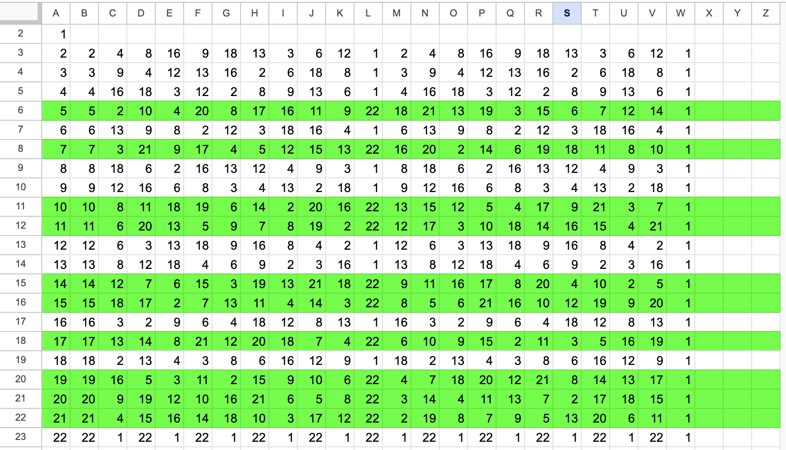

# Лабораторна робота №3

## Тема

Дослідження арифметичної системи GF(p). Скінченні поля Галуа

## Виконання

### Завдання 1

Побудувати таблицю мультиплікативних циклів елементів  М23 із GF(23).

Таблиця будується піднесенням кожного елемента в степінь кожного елемента, виконуючи при цьому операції за модулем $a^{j}mod23$. Якщо протягом всіх піднесень одиниця зустрілась лише в останньому, такий елемент вважається первісним, бо він має порядок та довжину циклу 22.

Для зручності, побудую цю таблицю в google sheets

### Завдання 2

Зробити відповідні операції над елементами 1.b=3, c=8;  2. b=12, c=9;  3. b=16, c=18.

#### Додавання

Операція виглядає наступним чином $a + b \equiv c\ (mod\ p)$

1. $b + c \equiv 3 + 8\ (mod\ 23) \equiv 11$
2. $b + c \equiv 12 + 9\ (mod\ 23) \equiv 21$
3. $b + c \equiv 16 + 18\ (mod\ 23) \equiv 11$

#### Віднімання

Ця операція зводиться до додавання оберненого елемента. Та її можна записати як $a - b \equiv a + (-b) \equiv c\ (mod\ p)$. А для обернення це просто модуль від від'ємного числа.

1. $b - c \equiv 3 - 8 \equiv 3 + (-8\ mod\ 23 ) \equiv 3 + 15 \equiv 18\ mod\ 23$
2. $b - c \equiv 12 - 9 \equiv 12 + (-9) \equiv 12 + 14 \equiv 26\ (mod\ 23) \equiv 3\ (mod\ 23)$
3. $b - c \equiv 16 - 18 \equiv 16 + (-18) \equiv 16 + 5 \equiv 21\ (mod\ 23)$

#### Множення

Операцію множення можна проводити за допомогою мультипликативної таблиці яку ми побудували в завданні 1. Для множення одного елемента на інший, треба знайти ці значення в циклі, та переписати їх через первісний елемент в певній степені, які ми потім додаєм за правилом степінь на степінь та шукаємо нове значення.

1. $3 * 8 \equiv 5^{16} * 5^6 \equiv 5^{16 + 6} \equiv 5^{22} \equiv 1\ (mod\ 23)$
2. $12 * 9 \equiv 7^8 * 7^4 \equiv 7^{12} \equiv 16\ (mod\ 23)$
3. $16 * 18 \equiv 17^{20} * 17^8 \equiv 17^{22 + 6} \equiv 1*17^{6} \equiv 12$

#### Ділення

1. $3 : 8 \equiv 10^{20} : 10^2 \equiv 10^{20-2} \equiv 10^{18} \equiv 9$
2. $12 : 9 \equiv 11^{12} : 11^6 \equiv 11^{12-6} \equiv 11^6 \equiv 9$
3. $16 : 18 \equiv 14^{14} : 14^{10} \equiv 14^{14-10} \equiv 14^4 \equiv 6$

#### Піднесення до степеня

1. $3^{35} \equiv (15^{10})^{35} \equiv 15^{350} \equiv 15^{15*22+20} \equiv 15^{20} \equiv 9\ (mod\ 23)$
2. $3^{41} \equiv (19^{4})^{41} \equiv 19^{164} \equiv 19^{7*22+10} \equiv 19^{10} \equiv 6\ (mod\ 23)$
3. $3^{53} \equiv (10^{20})^{53} \equiv 10^{1060} \equiv 10^{48*22+4} \equiv 10^{4} \equiv 18\ (mod\ 23)$
4. $8^{35} \equiv (11^{8})^{35} \equiv 11^{280} \equiv 11^{12*22+16} \equiv 11^{16} \equiv 18\ (mod\ 23)$
5. $8^{41} \equiv (17^{4})^{41} \equiv 17^{164} \equiv 17^{7*22+10} \equiv 17^{10} \equiv 4\ (mod\ 23)$
6. $8^{53} \equiv (20^{10})^{53} \equiv 20^{530} \equiv 20^{24*22+2} \equiv 20^{2} \equiv 9\ (mod\ 23)$
7. $12^{35} \equiv (19^{16})^{35} \equiv 19^{560} \equiv 19^{25*22+10} \equiv 19^{10} \equiv 6\ (mod\ 23)$
8. $12^{41} \equiv (20^{4})^{41} \equiv 20^{164} \equiv 20^{7*22+10} \equiv 20^{10} \equiv 8\ (mod\ 23)$
9. $12^{53} \equiv (5^{20})^{53} \equiv 5^{1060} \equiv 5^{48*22+4} \equiv 5^{4} \equiv 4\ (mod\ 23)$
10. $9^{35} \equiv (14^{12})^{35} \equiv 14^{420} \equiv 14^{19*22+2} \equiv 14^{2} \equiv 12\ (mod\ 23)$
11. $9^{41} \equiv (17^{14})^{41} \equiv 17^{574} \equiv 17^{26*22+2} \equiv 17^{2} \equiv 13\ (mod\ 23)$
12. $9^{53} \equiv (20^{2})^{53} \equiv 20^{106} \equiv 20^{4*22+18} \equiv 20^{18} \equiv 2\ (mod\ 23)$
13. $16^{35} \equiv (7^{12})^{35} \equiv 7^{420} \equiv 7^{19*22+2} \equiv 7^{2} \equiv 3\ (mod\ 23)$
14. $16^{41} \equiv (20^{6})^{41} \equiv 20^{246} \equiv 20^{11*22+4} \equiv 20^{4} \equiv 12\ (mod\ 23)$
15. $16^{53} \equiv (14^{14})^{53} \equiv 14^{742} \equiv 14^{33*22+16} \equiv 14^{16} \equiv 8\ (mod\ 23)$
16. $18^{35} \equiv (7^{18})^{35} \equiv 7^{630} \equiv 7^{28*22+14} \equiv 7^{14} \equiv 2\ (mod\ 23)$
17. $18^{41} \equiv (21^{6})^{41} \equiv 21^{246} \equiv 21^{11*22+4} \equiv 21^{4} \equiv 16\ (mod\ 23)$
18. $18^{53} \equiv (5^{12})^{53} \equiv 5^{636} \equiv 5^{28*22+20} \equiv 5^{20} \equiv 12\ (mod\ 23)$

#### Інверсія

1. $3^{-1} \equiv (17^{18})^{-1} \equiv 17^{-18} \equiv 17^{22} * 17^{-18} \equiv 17^{4} \equiv 8\ (mod\ 23)$
2. $8^{-1} \equiv (17^{4})^{-1} \equiv 17^{-4} \equiv 17^{22} * 17^{-4} \equiv 17^{18} \equiv 3\ (mod\ 23)$
3. $12^{-1} \equiv (19^{16})^{-1} \equiv 19^{-16} \equiv 19^{22} * 19^{-16} \equiv 19^{6} \equiv 2\ (mod\ 23)$
4. $9^{-1} \equiv (20^{2})^{-1} \equiv 20^{-2} \equiv 20^{22} * 20^{-2} \equiv 20^{20} \equiv 18\ (mod\ 23)$
5. $16^{-1} \equiv (10^{10})^{-1} \equiv 10^{-10} \equiv 10^{22} * 10^{-10} \equiv 10^{12} \equiv 13\ (mod\ 23)$
6. $18^{-1} \equiv (14^{10})^{-1} \equiv 14^{-10} \equiv 14^{22} * 14^{-10} \equiv 14^{12} \equiv 9\ (mod\ 23)$

#### Первісність

Потрібно перевірити критичні степені, на дільниках може утворитись одиниця. В цьому разі цикл буде коротким та число нам не буде підходити

Оберемо w = 3, p=163

Дільники 162: 2, 3, 6, 9, 18, 27, 54, 81

Знайдемо значення

$3^{2}\ (mod\ 701)=9$
$3^{3}\ (mod\ 701)=27$
$3^{6}\ (mod\ 701)=28$
$3^{9}\ (mod\ 701)=55$
$3^{18}\ (mod\ 701)=221$
$3^{27}\ (mod\ 701)=238$
$3^{54}\ (mod\ 701)=564$
$3^{81}\ (mod\ 701)=341$

3 не стало 1 на цих критичних степенях, тому це первісний елемент.

Розрахуємо для p=389

Знаходимо степені

$388 = 2 * 194 OR 4 * 97$

Знаходимо значення

$3^2\ (mod\ 389) = 9$
$3^4\ (mod\ 389) = 81$
$3^{97}\ (mod\ 389) = 275$
$3^{194}\ (mod\ 389) = 388$

Жодни з них не 1, тому це первісний елемент

Оберемо p=700

Критичні степені можуть бути

2;4;5;6;10;14;20;25;28;35;50;70;100;140;175;350;

Обрахуємо кожен

$3^{2}\ (mod\ 701)=9$
$3^{4}\ (mod\ 701)=81$
$3^{5}\ (mod\ 701)=243$
$3^{7}\ (mod\ 701)=84$
$3^{10}\ (mod\ 701)=165$
$3^{14}\ (mod\ 701)=46$
$3^{20}\ (mod\ 701)=587$
$3^{25}\ (mod\ 701)=338$
$3^{28}\ (mod\ 701)=13$
$3^{35}\ (mod\ 701)=391$
$3^{50}\ (mod\ 701)=682$
$3^{70}\ (mod\ 701)=63$
$3^{100}\ (mod\ 701)=361$
$3^{140}\ (mod\ 701)=464$
$3^{175}\ (mod\ 701)=566$
$3^{350}\ (mod\ 701)=700$

Оскільки тут також не було 1, 3 тут також первісний елемент

## Висновок

На цій лабораторній роботі я дослідив арифметичну систему GF(p) та працював зі скінченими полями Галуа
