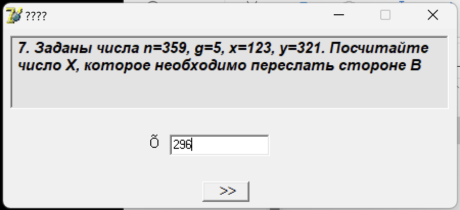
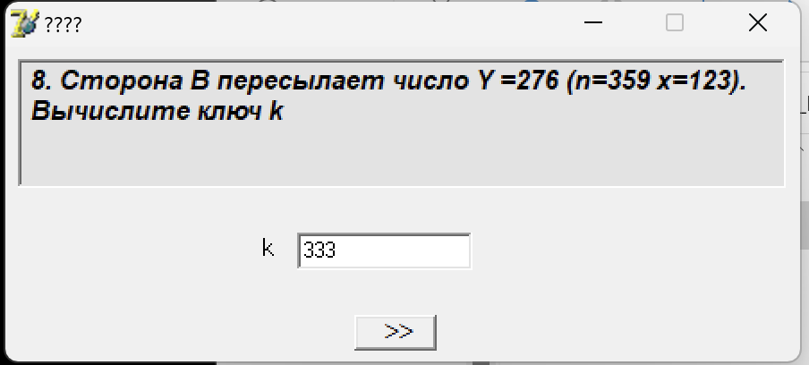
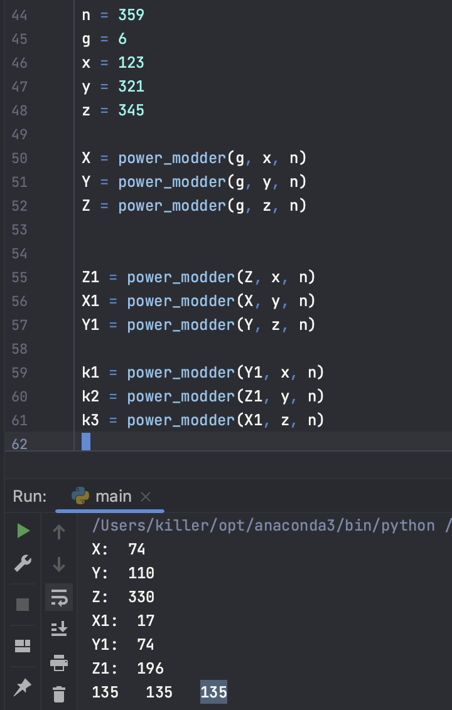
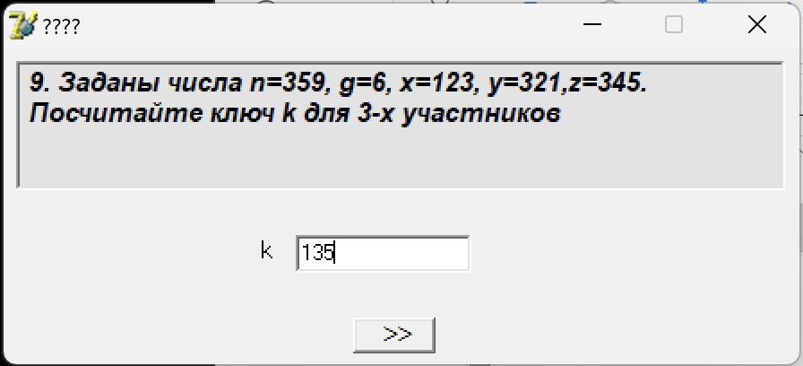
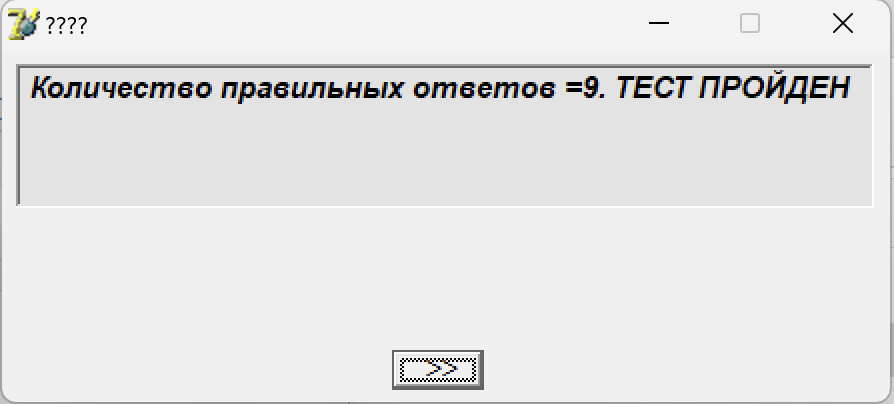

# Лабораторна робота №4

## Тема

Дослідження криптосистеми Діффі-Хеллман

## Виконання

## Висновок

На цій лабораторній роботі я розібрався з криптосистемою Діффі-Хеллмана, вивчив базову теорію щодо неї та навчився кодувати шифрувати та передавати ключі
