# Лабораторна робота №8

## Тема

Криптосистема еліптичних кривих

## Виконання

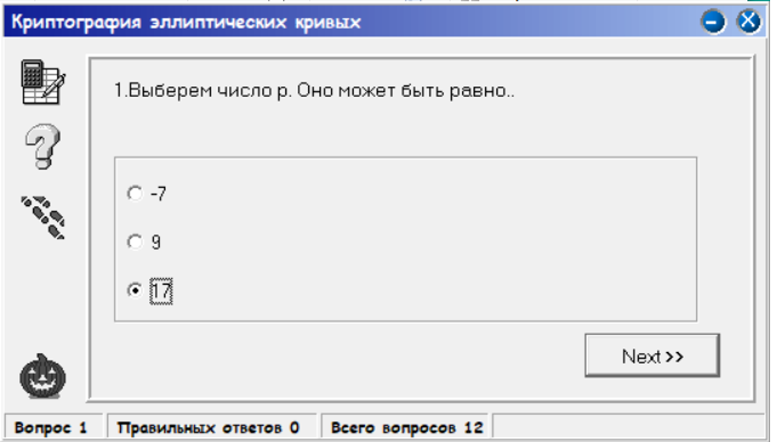

Повинно бути простим

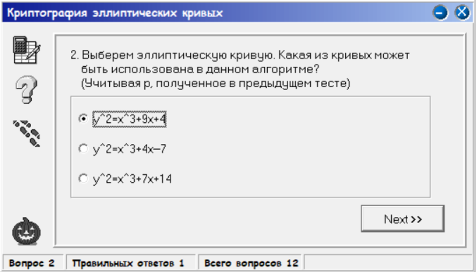

```python
def check(a, b):
    return ((4 * a * a * a) + (27 * b * b)) % p != 0

>>> print(check(9, 4))

True
```

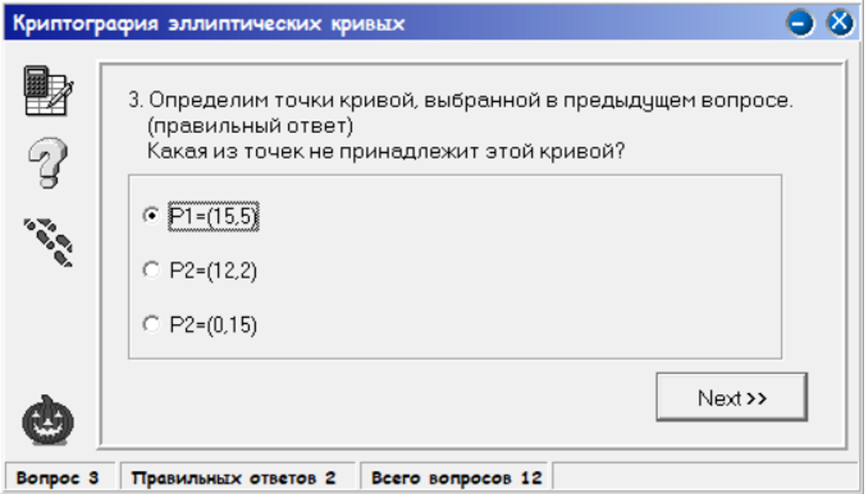

```python
def elip(x, y):
    return powm(y, 2) == (powm(x, 3) + 9 * x + 4) % p


print(f'{elip(15, 5)}')
print(f'{elip(12, 2)}')
print(f'{elip(0, 15)}')

>>>
False
True
True
```

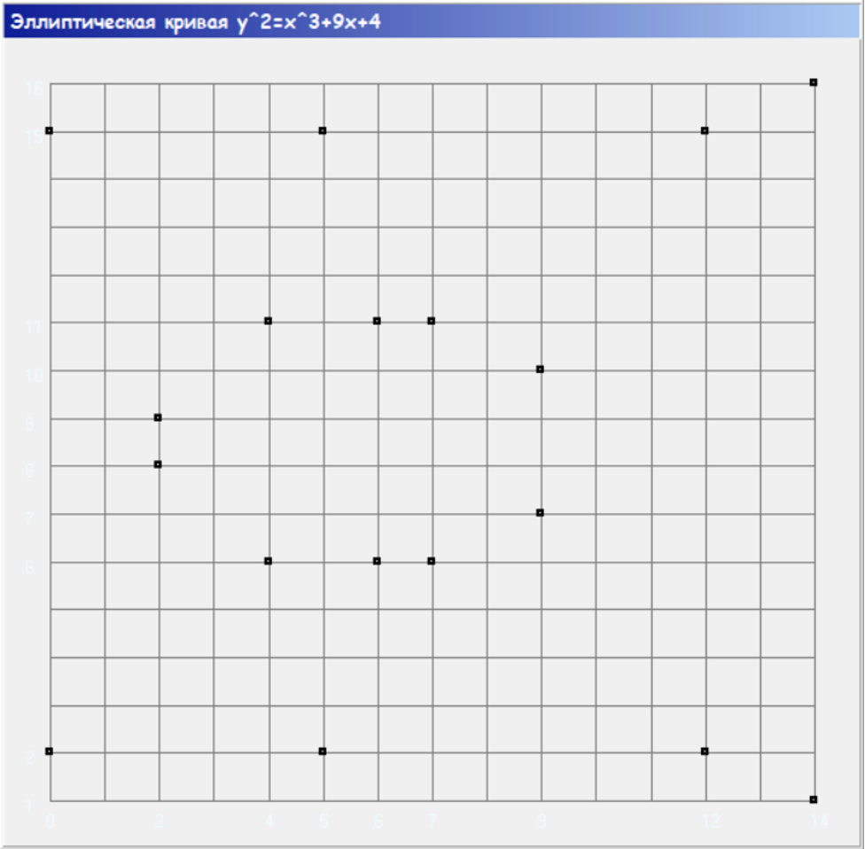

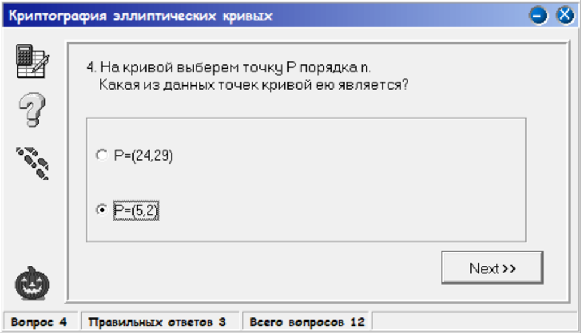

Оскільки порядок n=19, перша точка не підходить

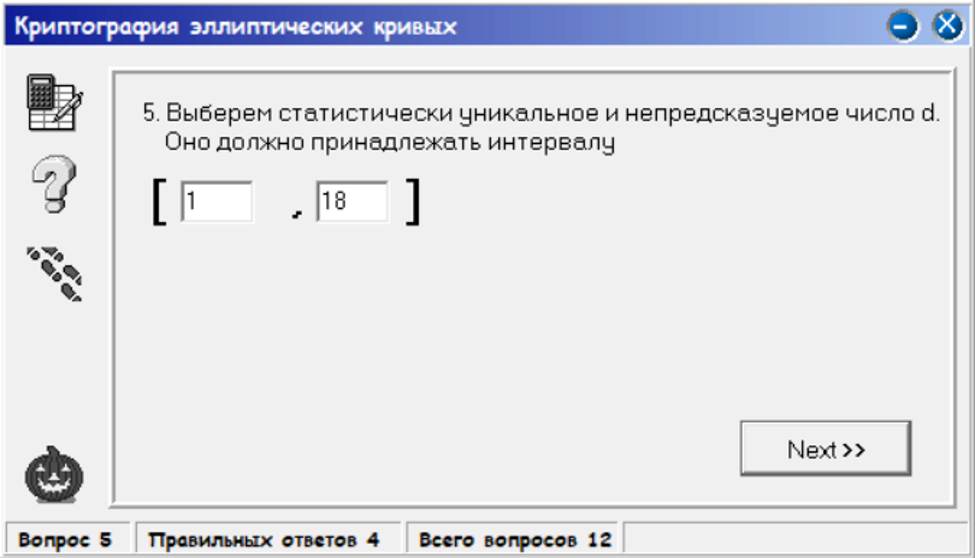

Від 1 до порядок -1

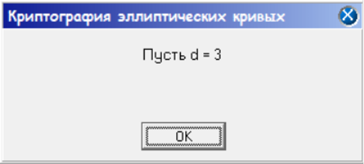

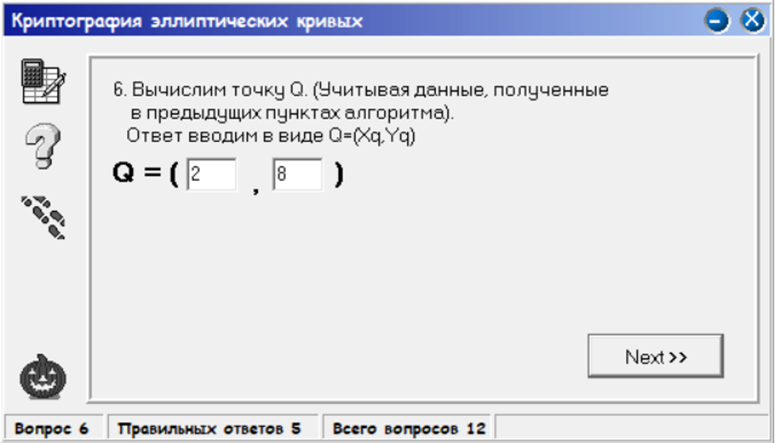

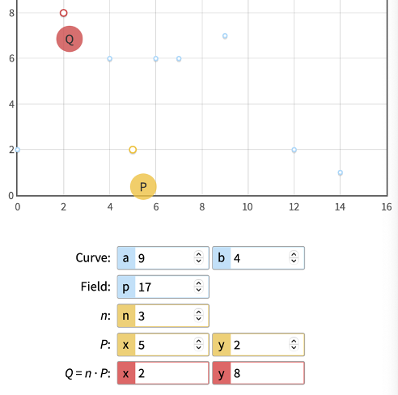

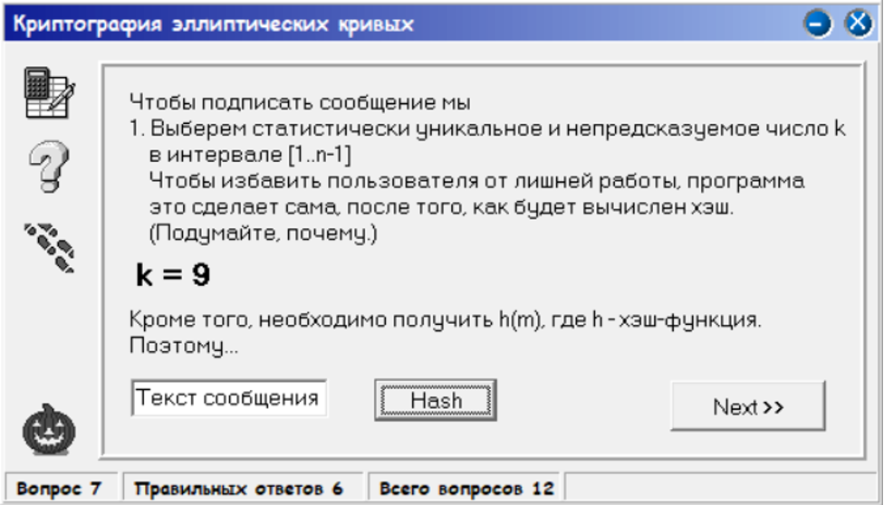

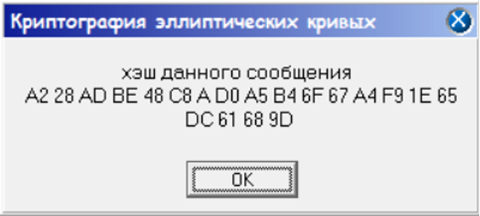

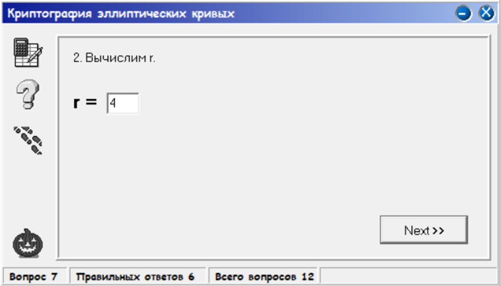

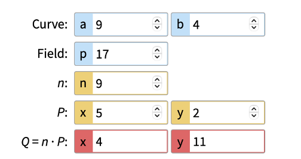

```python
(x1, y1) = (4, 11)
print(x1 % n)
>>>
4
```

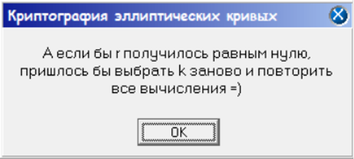

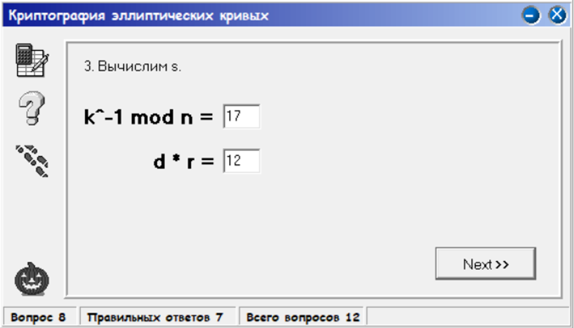

```python
def inverse(x):
    res = 1
    for i in range(n):
        if (x * i) % n == 1:
            return i

print(inverse(9))
>>>
17
```

$d * r = 3 * 4 = 12$

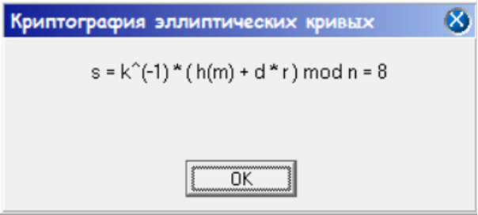

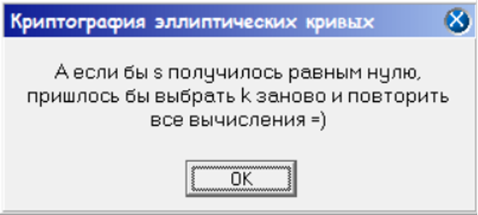

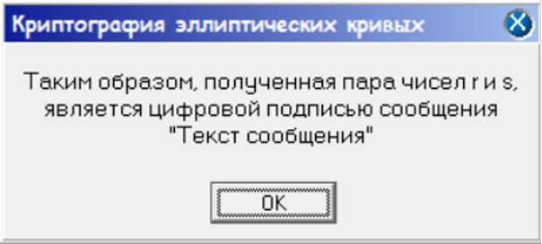

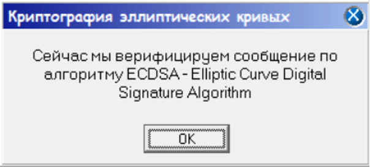

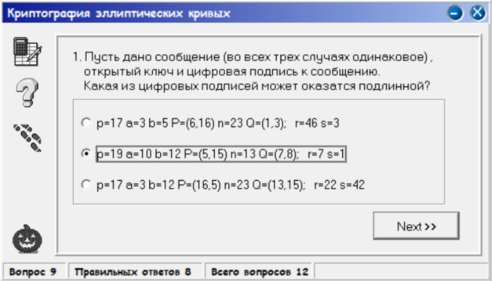
Значення r та s можуть бути тільки в [1, n-1]

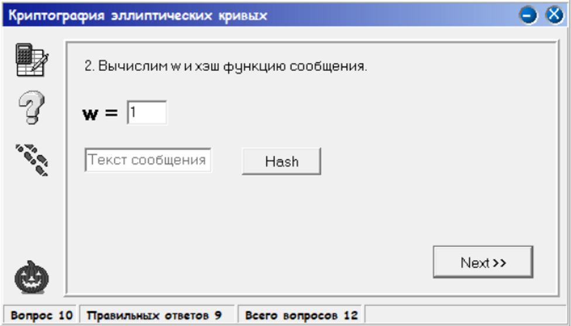
Обернений елемент до 1 - це 1

```python
def inverse(x):
    res = 1
    for i in range(n):
        if (x * i) % n == 1:
            return i

print(inverse(1))
>>>
1
```


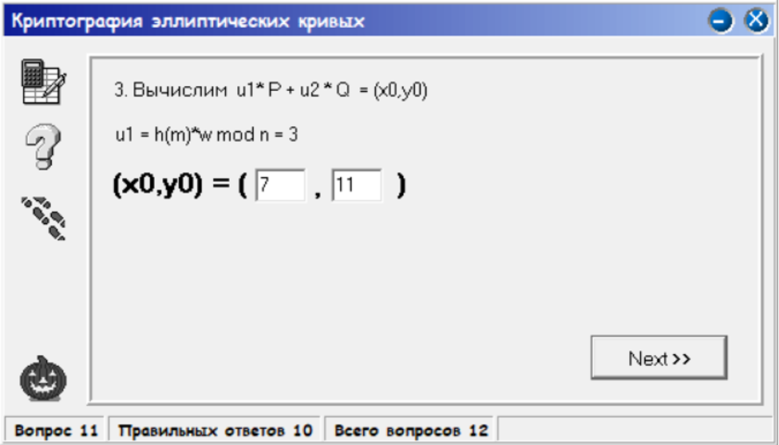

$u_2 = r * w\ mod\ n = 7 * 1\ mod\ 13 = 7$

```python
def point_addition(P, Q, a, p):
    if P == (0, 0):
        return Q
    if Q == (0, 0):
        return P
    if P == Q:
        num = (3 * P[0] ** 2 + a) % p
        denom = (2 * P[1]) % p
    else:
        num = (Q[1] - P[1]) % p
        denom = (Q[0] - P[0]) % p

    inv_denom = pow(denom, p - 2, p)

    m = (num * inv_denom) % p

    x_r = (m ** 2 - P[0] - Q[0]) % p
    y_r = (m * (P[0] - x_r) - P[1]) % p
    return (x_r, y_r)


def scalar_multiplication(P, n, a, p):
    Q = (0, 0)
    for _ in range(n):
        Q = point_addition(Q, P, a, p)
    return Q


a = 10
b = 12
p = 19
n = 3
P = (5, 15)

R1 = scalar_multiplication(P, u1, a, p)
R2 = scalar_multiplication(Q, u2, a, p)

Result = point_addition(R1, R2, a, p)
print(Result)
>>>
(7, 11)
```


$v = x_0\ mod\ n = 7\ mod\ 13 = 7$

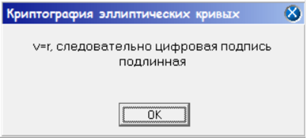

Оскільки значення співпадають, цифровий підпис - правильний

### Звіт

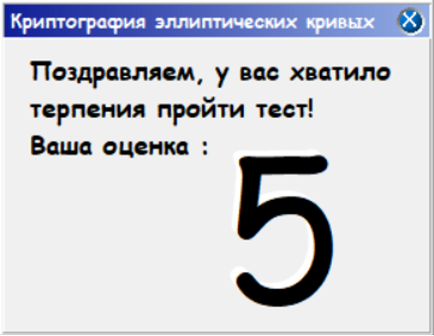

## Висновок

На цій лабораторній роботі я дослідив криптографію еліптичних кривих, також реалізував базові операціями над точкими в кривих
